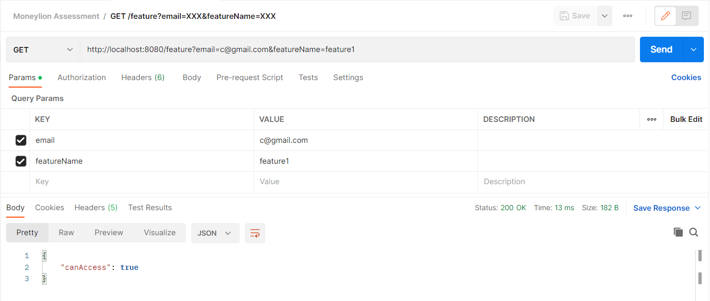
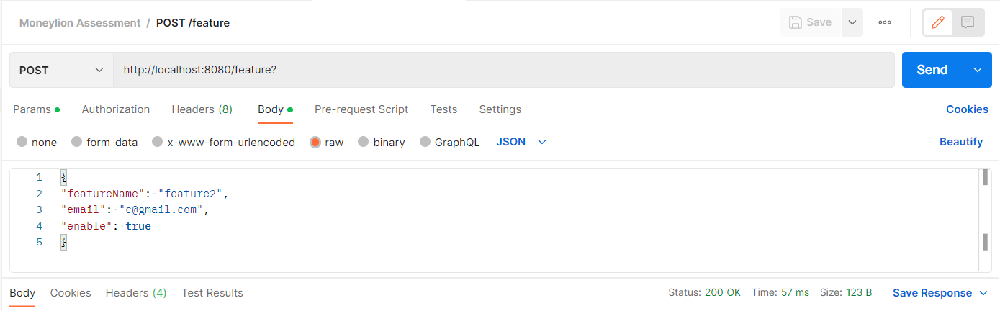
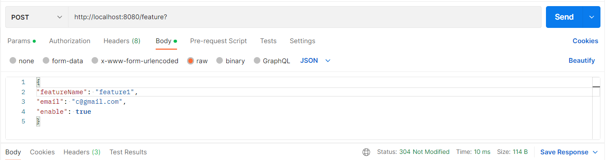

# FeatureServices

## Requirement

* GET /feature?email=XXX&featureName=XXX
This endpoint receives email (user’s email) and featureName as request parameters and
returns the following response in JSON format.

Example Response:
```
{
    "canAccess": true|false (will be true if the user has access to the featureName
}
```


* POST /feature
This endpoint receives the following request in JSON format and returns an empty
response with HTTP Status OK (200) when the database is updated successfully, otherwise
returns Http Status Not Modified (304).

Example Request:

```
{
    "featureName": "xxx", (string)
    "email": "xxx", (string) (user's name)
    "enable": true|false (boolean) (uses true to enable a user's access, otherwise
}
```

## Sample Result

### Check user access


### Update user access


### Update user access (return 304)
Update user access with the current access value.
** Note: Assume updating user access with the same value will return Http Status Not Modified (304).
